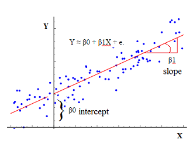

## Let us start

```{r, results = 'asis'}
library(knitr)
library(reshape)
dFrame <- melt(HairEyeColor)
kable(head(dFrame[dFrame$Sex == 'Male', ], 4), format = "markdown")
```

---

## Interactive Chart

```{r echo = F, results = 'asis'}
library(rCharts)
haireye = as.data.frame(HairEyeColor)
n1 <- nPlot(Freq ~ Hair, group = 'Eye', type = 'multiBarChart', data = subset(haireye, Sex == 'Male'))
n1$print('chart1')
```


--- &vcenter

## Coming to basic Regression Modelling

$$cov(X, Y) = E[(X - E(X))(Y - E(Y))]$$
$$cov(X, Y) = \frac{1}{n} \sum_{i=1,n}(x - E(X))(y - E(Y))$$
$$cov(X, X) = Var(X) \equiv \sigma^{2}(X)$$
$$cor(X, Y) = \frac{cov(X, X)}{\sigma(X) \sigma(Y)}$$


---

## Regression Modelling continued...

```{r, results = 'asis'}
library(knitr)
kable(head(mtcars, 10), format = "markdown")
```

---

## Regression Modelling still continues...

```{r fig.width = 12, fig.height = 3, fig.align = "center", out.width = "1100px"}
library(ggplot2)
library(gridExtra)
base <- ggplot(mtcars, aes(qsec, wt))
pt_1 <- base + stat_smooth(method = "lm") + geom_point()

base <- ggplot(mtcars, aes(y = wt, x = qsec, colour = factor(cyl)))
pt_2 <- base + stat_smooth(method = lm, aes(fill = factor(cyl))) + geom_point()
grid.arrange(pt_1, pt_2, ncol = 2)
```

--- &interactive

## Talking about Exploratory Data Anaytics

```{r echo = F, results = 'asis', message = F}
library(googleVis)
M1 <- gvisMotionChart(Fruits, idvar = 'Fruit', timevar = 'Year')
print(M1, tag = 'chart')
```


